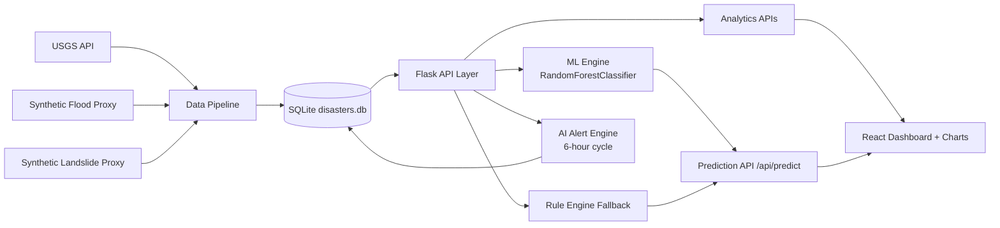

# Disaster Detector Research Notes

## 1) Risk Score Equations

### 1.1 Rule-Based Baseline
For disaster-specific handcrafted logic:

- `Score_rule in [0, 100]`
- `Risk_level = {Low, Medium, High}` by thresholding:
  - `Low` if `< 40`
  - `Medium` if `40..74`
  - `High` if `>= 75`

### 1.2 ML-Feature Equation (Hybrid Interpretation)
Normalized hazard terms:
- `S = norm(seismic_magnitude)`
- `D = 1 - norm(depth_km)`
- `Rf = norm(rainfall_24h_mm)`
- `M = soil_moisture`
- `Sl = norm(slope_deg)`
- `V = 1 - ndvi`

Weighted score:

`R = w1*S + w2*D + w3*Rf + w4*M + w5*Sl + w6*V`

with
- `w1=0.24, w2=0.16, w3=0.20, w4=0.14, w5=0.16, w6=0.10`

Mapping:
- `R < 0.4` -> `Low`
- `0.4 <= R <= 0.7` -> `Medium`
- `R > 0.7` -> `High`

## 2) System Architecture Diagram



## 3) Data Flow Diagram

```mermaid
flowchart TD
  S1[Scheduler trigger] --> P1[Sync earthquakes every 6h]
  S1 --> P2[Generate floods every 24h]
  S1 --> P3[Generate landslides every 24h]
  P1 --> DB[(SQLite)]
  P2 --> DB
  P3 --> DB

  U1[User input / Predictor page] --> API1[/api/predict]
  API1 --> FE1[Feature extraction]
  FE1 --> ML1[RandomForest inference]
  FE1 --> RB1[Rule fallback]
  ML1 --> RES[Risk level + confidence + explanation]
  RB1 --> RES
  RES --> U2[Frontend visualization]

  DB --> A1[7-day trend computation]
  A1 --> A2[Alert condition check]
  A2 --> DB
  DB --> U3[Alerts page]
```

## 4) Dataset Description (Hybrid: Synthetic + Real)

- Earthquake records: real-time event feed from USGS, India-filtered by geobounds/place.
- Flood records: rainfall-driven proxy (IMD-style threshold buckets).
- Landslide records: daily proxy from rainfall, slope, soil moisture, NDVI.
- Unified feature space:
  - `latitude`, `longitude`
  - `rainfall_24h_mm`, `soil_moisture`, `slope_deg`
  - `ndvi`, `plant_density`
  - `seismic_magnitude`, `depth_km`
- Label: `risk_level` (`Low`, `Medium`, `High`)

The dataset is reproducible through `backend/generate_dataset.py` and suitable for controlled experimentation and model benchmarking.
